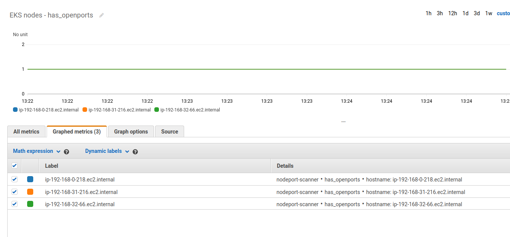

# README

This project was developed for demo purposes in order to get a quick implementation of an agent that scans open ports in EKS cluster nodes and reports the findings to a centralized logging system (AWS Cloudwatch in this scenario). 

This project has been tested on AWS EKS but could be used in any Kubernetes cluster or even in any other Linux-based system.

The script takes into account open TCP IPv4 ports listening on 0.0.0.0

The solution is containerized and orchestrated via Kubernetes. A DaemonSet makes sure that the agent is executed in every cluster node. The pod in each node consists of two containers: 

* portscanner -- core logic, scans open ports and stores the raw data into a volume.
* fluentd -- sidecar container that has access to the volume where data is stored, parses it and streams it into CloudWatch.

*NOTE: It would be advisable to add a third container with log rotation logic. This was out of scope for this project since we do not aim to run it in production systems at this point.*

The portscanner docker image is fetched from a private DockerHub repository. A secret was created in Kubernetes for login into this repository and be able to pull the image:

```
# kubectl create secret docker-registry regcred --docker-server=https://index.docker.io/v1/ --docker-username=... --docker-password=... --docker-email=... -n portscanner
# kubectl get secret regcred --output="jsonpath={.data.\.dockerconfigjson}" | base64 --decode
```

In order for the container to have access to the host system network stack, it is necessary to set the ``hostNetwork`` to ``true`` within the DaemonSet spec.

The solution makes use of the following Kubernetes manifests:

* kubernetes/namespace.yaml -- It creates the namespace.
* kubernetes/fluentd_rbac.yaml -- It creates the ClusterRole and ClusterRoleBinding for fluentd and its associated ServiceAccount. It also creates the ConfigMap that will be used by fluentd. 
* kubernetes/portscanner-daemonset.yaml -- DaemonSet that makes sure a pod is running in every cluster node.

The manifests can be applied by running the following command:

```
kubectl apply -f <MANIFEST.yaml>
```

The ServiceAccount is bound to the following IAM policy in AWS, which grants permissions to operate with CloudWatch Logs:

```
arn:aws:iam::aws:policy/CloudWatchAgentServerPolicy
```

In order to create the ServiceAccount within EKS, the following commands were executed:

```
# eksctl utils associate-iam-oidc-provider --cluster fgonzalez-eks --region us-east-1 --approve
# eksctl create iamserviceaccount --name logging-sa --namespace portscanner --cluster fgonzalez-eks --attach-policy-arn arn:aws:iam::aws:policy/CloudWatchAgentServerPolicy --region us-east-1 --approve
```

## Node scanner

The script may take two optional arguments:

```
portscanner
-i / interval for report logging
-e / list of comma-separated port numbers to be excluded in the report
```

If no argument is specified, the script will report at a default interval (i.e. 60s) and no whitelisting will take place.

## Local testing

It is possible to build the image locally via the provided Dockerfile:

```
# docker build -t portscanner .
```

The following command is an example of execution where the interval is overwritten to report every 10s and the ports 22 and 80 are excluded from the report:

```
# docker run portscanner -i 10 -e 22,80
```

The following command is meant for troubleshooting purposes or if you just want to dive deeper into the container:

```
# docker run -ti --rm --net=host --entrypoint /bin/bash portscanner
```

*NOTE: The script is located at ``/opt/portscanner`` and the log is stored in a volume mounted at ``/var/log/portscanner/portscanner.log``*

## CloudWatch

Once the logs are streamed into CloudWatch, it is possible to create metric filters in order visualize and/or alert based on those custom metrics.

The logs are streamed by fluentd into a separate CloudWatch loggroup per node. A metric filter is configured in each loggroup in order to create a custom metric (i.e. has_openports), which indicates whether the node has open ports currently or not. The metric contains a dimension for the hostname.



Additionally, an alarm has also been created in CloudWatch in order to alert if a specific logstream stops receiving logs.


## List of improvements

The following list considers potential improvement opportunities.

* Extend alarms in CloudWatch to handle application errors.
* Implement more metrics in CloudWatch, such as a count for the number of open ports in each node.
* Proper validation of script input arguments.
* Add support for IPv6 ports and to select the application protocol (TCP, UDP)

